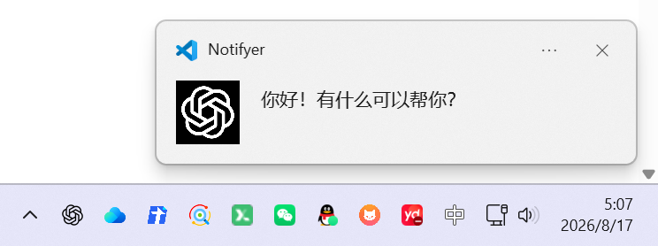
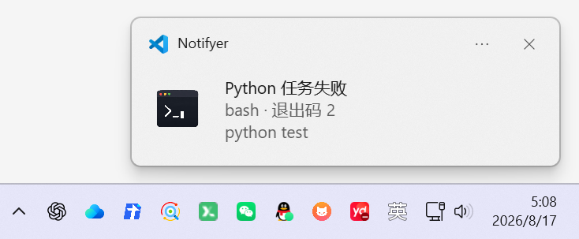
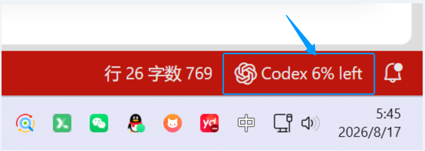

# Notifyer

Language: <a href="https://github.com/mapengsen/Notifyer">English (default)</a> | <a href="https://github.com/mapengsen/Notifyer/blob/main/README.zh-CN.md">简体中文</a>

Notifyer is a VS Code extension that combines Codex and Claude Code task notifications, remaining usage for both providers, and terminal command notifications in one place.

When using AI coding tools such as Codex and Claude Code, have you ever run into this situation?

> You hand code generation to AI, run tests in the terminal, and wait tens of minutes for builds and deployments. You hesitate to step away because you might miss a completed task, a failed test, or an AI waiting for confirmation.

What really consumes time is often not coding itself, but repeatedly switching back to the terminal to check progress. This project is designed to solve that problem. It provides a VS Code extension that lets developers hand long-running tasks to the terminal and AI agents while working on something else; when a task finishes, desktop or VS Code notifications let you know promptly.

**GitHub**: [github.com/mapengsen/Notifyer](https://github.com/mapengsen/Notifyer)

**Plugin**: [marketplace.visualstudio.com/items?itemName=pengsen.codex-task-companion](https://marketplace.visualstudio.com/items?itemName=pengsen.codex-task-companion)

## What can it do?

### 1. Monitor AI coding tasks (desktop notifications)

Notifyer monitors the main-task status of AI agents such as Codex and Claude Code. When a task finishes, the extension sends a desktop notification. Child agents and background processes do not constantly interrupt you, keeping notifications useful.

### 2. Monitor terminal commands (desktop notifications)

Notifyer monitors commands running in the terminal and sends a desktop notification when a command succeeds or fails. By default, only Python commands trigger notifications, including `python`, `python3`, `python3.12`, Windows `py`/`pythonw`, and full executable paths such as `/opt/conda/envs/.../bin/python`. Turn off `codexTaskCompanion.terminal.pythonOnly` to restore notifications for every command outside the ignored-command list.

When you click a desktop notification, Notifyer targets the exact VS Code window that produced it. Codex notifications preserve the current editor and layout; terminal notifications additionally reveal the originating terminal.

### 3. View Codex and Claude usage in VS Code

Notifyer can display Codex and Claude Code usage directly in the VS Code status bar, including remaining percentages, used percentages, and reset times. You can keep track of the current account status without repeatedly opening a webpage or terminal.

At startup, both quota widgets refresh immediately and then retry every 30 seconds for 3 minutes (six scheduled retries). After that startup window, they use the configured regular refresh interval, which defaults to 10 minutes.

Quota credentials are isolated to the environment connected by the current VS Code window:

- A local Windows window reads only `%USERPROFILE%\.codex\auth.json` and `%USERPROFILE%\.claude\.credentials.json` (or the current environment's `CODEX_HOME` / `CLAUDE_CONFIG_DIR`).
- A WSL, Remote SSH, or container window reads only the current remote user's `~/.codex/auth.json` and `~/.claude/.credentials.json`.
- Notifyer never falls back to another local/remote environment and never scans another user's home directory. If the current environment is not authenticated, its quota item stays hidden.

For unusual remote home layouts, set `codexTaskCompanion.codex.credentialsPath` or `codexTaskCompanion.claude.credentialsPath`; the configured path is still resolved inside the current VS Code environment. Claude's login credential file is `.credentials.json`, not `settings.json`.

# Changelog

## August 19, 2026 (0.2.20)

1. Codex and Claude quotas now refresh immediately at startup, retry every 30 seconds for 3 minutes, and then return to the regular 10-minute default interval.

## August 19, 2026 (0.2.19)

1. Hovering over the Codex or Claude quota item now explains the meaning of the displayed percentage and reset timestamp, identifies the represented quota window, and retains the full per-window details below.

## August 19, 2026 (0.2.18)

1. Codex and Claude quota status items now show the full local reset date and time, for example `5% left | 8-20 11:24` or `5% used | 8-20 11:24`.

## August 19, 2026 (0.2.17)

1. Terminal desktop notifications now monitor only Python commands by default, including full Python executable paths inside Conda environments. The previous behavior can be restored by turning off Python-only mode in settings.

2. Codex and Claude quota status items now use a compact single-line format such as `5% left | 8-20 reset` or `5% used | 8-20 reset`, with reset dates shown as the local month and day.

3. Codex and Claude quota credentials are now isolated by the current VS Code environment. Local Windows, WSL, Remote SSH, and containers use only their own login files, with no cross-environment fallback or other-user directory scanning.

## August 18, 2026 (0.2.16)

1. Clicking a Codex desktop notification now only restores the originating VS Code window and no longer opens a Codex conversation tab automatically.

## August 18, 2026

1. Fixed an issue where clicking a notification with multiple VS Code windows open would only activate the last-used window.

2. Terminal notifications now restore the originating terminal in the correct VS Code window.

## August 18, 2026, 10:10:55

1. Added desktop notifications for all terminal commands except common Linux commands such as `ls`, `ll`, and `pwd`.

2. Clicking a desktop notification now prioritizes the VS Code window that generated it; terminal notifications additionally reveal the corresponding terminal.
