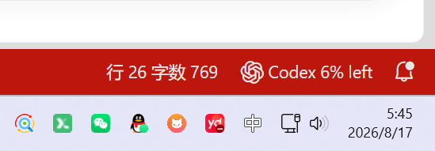

# Notifyer

Language: <a href="./README.md">English (default)</a> | <a href="./README.zh-CN.md">简体中文</a>

Notifyer is a VS Code extension that combines Codex and Claude Code task notifications, remaining usage for both providers, and Python terminal notifications in one place.

When using AI coding tools such as Codex and Claude Code, have you ever run into this situation?

> You hand code generation to AI, run tests in the terminal, and wait tens of minutes for builds and deployments. You hesitate to step away because you might miss a completed task, a failed test, or an AI waiting for confirmation.

What really consumes time is often not coding itself, but repeatedly switching back to the terminal to check progress. This project is designed to solve that problem. It provides a VS Code extension that lets developers hand long-running tasks to the terminal and AI agents while working on something else; when a task finishes, desktop or VS Code notifications let you know promptly.

## What can it do?

### Monitor AI coding tasks (desktop notifications)

Notifyer monitors the main-task status of AI agents such as Codex and Claude Code. When a task finishes, the extension sends a desktop notification. Child agents and background processes do not constantly interrupt you, keeping notifications useful.

### Monitor terminal commands (desktop notifications)

Notifyer monitors tasks running in the terminal and sends a desktop notification when a task succeeds or fails.

### View Codex and Claude usage (in VS Code)

Notifyer can display Codex and Claude Code usage directly in the VS Code status bar, including remaining percentages, used percentages, and reset times. You can keep track of the current account status without repeatedly opening a webpage or terminal.

