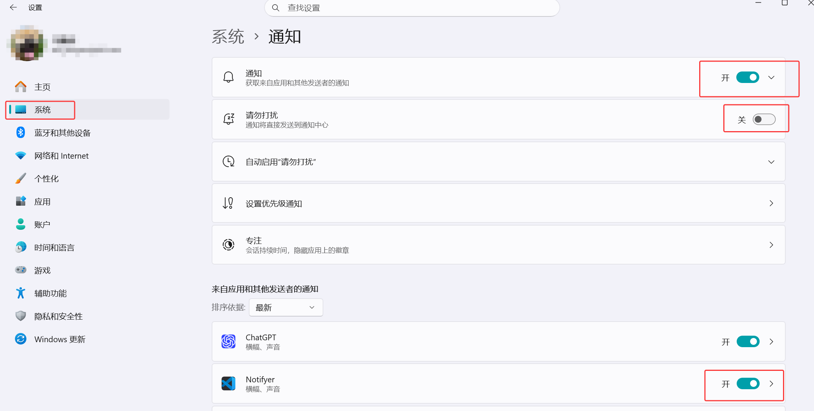

# Notifyer

Language: <a href="https://github.com/mapengsen/Notifyer">English (default)</a> | <a href="https://github.com/mapengsen/Notifyer/blob/main/README.zh-CN.md">简体中文</a>

Notifyer is a focused local-notification extension for Codex and Claude Code main-task completion and terminal commands in VS Code.

When using AI coding tools such as Codex and Claude Code, have you ever run into this situation?

> You hand code generation to AI, run tests in the terminal, and wait tens of minutes for builds and deployments. You hesitate to step away because you might miss a completed task, a failed test, or an AI waiting for confirmation.

What really consumes time is often not coding itself, but repeatedly switching back to the terminal to check progress. This project is designed to solve that problem. It provides a VS Code extension that lets developers hand long-running tasks to the terminal and AI agents while working on something else; when a task finishes, desktop or VS Code notifications let you know promptly.

**GitHub**: [github.com/mapengsen/Notifyer](https://github.com/mapengsen/Notifyer)

**Plugin**: [marketplace.visualstudio.com/items?itemName=pengsen.codex-task-companion](https://marketplace.visualstudio.com/items?itemName=pengsen.codex-task-companion)

**All My Plugin Recommendations:**

1. **Notifyer Plugin**: [marketplace.visualstudio.com/items?itemName=pengsen.codex-task-companion](https://marketplace.visualstudio.com/items?itemName=pengsen.codex-task-companion)
2. **Agent Center**: [marketplace.visualstudio.com/items?itemName=pengsen.codex-claude-agent-status](https://marketplace.visualstudio.com/items?itemName=pengsen.codex-claude-agent-status)

## What can it do?

### 1. Monitor AI coding tasks (desktop notifications)

Notifyer monitors the main-task status of AI agents such as Codex and Claude Code. When a task finishes, the extension sends a desktop notification. Child agents and background processes do not constantly interrupt you, keeping notifications useful.

In WSL, Remote SSH, and container windows, Codex monitoring covers both the connected environment and the local UI environment by default. This allows the same VS Code window to detect tasks written by either remote Codex or local Codex Desktop. Set `codexTaskCompanion.codex.sessionsRoot` only when you want to monitor one explicit directory.

### 2. Monitor terminal commands (desktop notifications)

Notifyer monitors commands running in the terminal and sends a desktop notification when a command succeeds or fails. By default, only Python commands trigger notifications, including `python`, `python3`, `python3.12`, Windows `py`/`pythonw`, and full executable paths such as `/opt/conda/envs/.../bin/python`. Turn off `codexTaskCompanion.terminal.pythonOnly` to restore notifications for every command outside the ignored-command list.

When you click a desktop notification, Notifyer targets the exact VS Code window that produced it. Codex notifications preserve the current editor and layout; terminal notifications additionally reveal the originating terminal.

# If an issue occurs:

Make sure your Windows notifications are enabled and "Do Not Disturb" is turned off.

## Codex and Claude quota display

Starting with 0.3.0, quota display has moved to the independent **Agent Center** extension:

- Agent Center contains only the Codex/Claude quota status bar and no desktop notifications.
- It runs locally for normal workspaces and directly in the connected environment for Remote SSH, WSL, and containers.
- Remote credential reads and quota requests stay entirely on the remote server, with no hidden companion and no token transfer between extensions.

Agent Center: [marketplace.visualstudio.com/items?itemName=pengsen.codex-claude-agent-status](https://marketplace.visualstudio.com/items?itemName=pengsen.codex-claude-agent-status)

# Changelog

## August 24, 2026 (0.3.5)

1. Codex monitoring now watches both local and connected WSL, Remote SSH, or container session directories by default, preventing local Codex Desktop completions from being missed in remote VS Code windows.
2. Windows drive paths and equivalent WSL `/mnt/<drive>` paths now match the same workspace.
3. Notifyer diagnostics now show all monitored Codex session roots and the latest completion-event outcome.

## August 24, 2026 (0.3.4)

1. Updated current README references and plugin recommendations to use the new Agent Center display name while retaining the existing Marketplace extension ID.

## August 24, 2026 (0.3.3)

1. Fixed premature notifications during multi-agent Codex tasks by preserving subagent identity when inherited parent-session metadata appears later in the same JSONL file.
2. Codex session identity now resets correctly when a tracked JSONL file is truncated and rebuilt.

## August 20, 2026 (0.3.2)

1. Fixed desktop notification clicks that failed to restore the originating VS Code window on Windows by recognizing more activation values and adding native focus fallbacks and retries.
2. Notifyer diagnostics now include the latest notification callback and window-focus result.

## August 19, 2026 (0.3.1)

1. Added “All My Plugin Recommendations” to both READMEs and updated the Agent Status Marketplace link.

## August 19, 2026 (0.3.0)

1. Notifyer now focuses on local Codex, Claude, and terminal notifications.
2. Codex and Claude quota display moved to the independent Agent Status extension; the hidden Workspace Companion design was removed.

## August 19, 2026 (0.2.21)

1. Codex and Claude quota items now display an animated refresh indicator while a startup, scheduled, or manual refresh request is running.

## August 19, 2026 (0.2.20)

1. Codex and Claude quotas now refresh immediately at startup, retry every 30 seconds for 3 minutes, and then return to the regular 10-minute default interval.

## August 19, 2026 (0.2.19)

1. Hovering over the Codex or Claude quota item now explains the meaning of the displayed percentage and reset timestamp, identifies the represented quota window, and retains the full per-window details below.

## August 19, 2026 (0.2.18)

1. Codex and Claude quota status items now show the full local reset date and time, for example `5% left | 8-20 11:24` or `5% used | 8-20 11:24`.

## August 19, 2026 (0.2.17)

1. Terminal desktop notifications now monitor only Python commands by default, including full Python executable paths inside Conda environments. The previous behavior can be restored by turning off Python-only mode in settings.
2. Codex and Claude quota status items now use a compact single-line format such as `5% left | 8-20 reset` or `5% used | 8-20 reset`, with reset dates shown as the local month and day.
3. Codex and Claude quota credentials are now isolated by the current VS Code environment. Local Windows, WSL, Remote SSH, and containers use only their own login files, with no cross-environment fallback or other-user directory scanning.

## August 18, 2026 (0.2.16)

1. Clicking a Codex desktop notification now only restores the originating VS Code window and no longer opens a Codex conversation tab automatically.

## August 18, 2026

1. Fixed an issue where clicking a notification with multiple VS Code windows open would only activate the last-used window.
2. Terminal notifications now restore the originating terminal in the correct VS Code window.

## August 18, 2026, 10:10:55

1. Added desktop notifications for all terminal commands except common Linux commands such as `ls`, `ll`, and `pwd`.
2. Clicking a desktop notification now prioritizes the VS Code window that generated it; terminal notifications additionally reveal the corresponding terminal.
